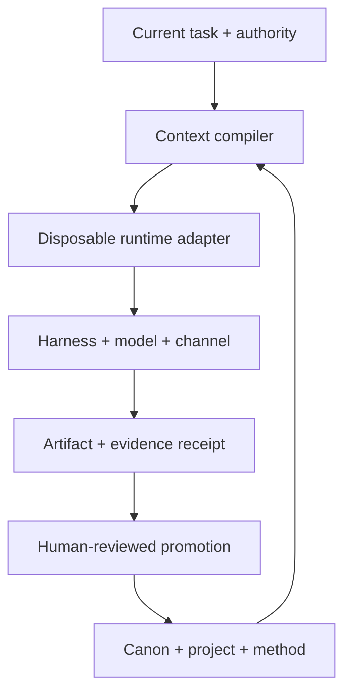

# Portable Personal-AI / Sovereign-Node Convergence

**Resolved date:** 26 August 2026 (Asia/Singapore)

**Evidence labels:** **RECOVERED** = found in prior personal material; **CURRENTLY VERIFIED** = inspected artifact or current primary documentation; **INFERENCE** = conclusion drawn from multiple traces; **PROPOSAL** = not yet tested. A generated file is evidence that code was authored, not that it was run.

## 1. ONE-PAGE VERDICT

The work is **design-rich and implementation-light**. The durable decisions are clear: local-first canonical files; runtime-neutral meaning; provenance; reversible promotion from messy work; bounded agents; deterministic scripts for deterministic steps; and no framework or model as constitution. What is not established is equally important: there is no accessible evidence that the intended Mac mini node, Nix-Darwin state, Hermes, Ollama models, phone edge node, responder, or Hermes→Codex loop is presently installed and working.

What actually exists is useful. **RECOVERED:** a falsifiable AXIS-7 proposal; a stronger sovereign-node report that explicitly says the machine state is unverified; a 117-record Project Federation workbook; Hermes/Codex task-packet designs; two shell generators plus a richer HTML generator; and repeated cross-domain transformation patterns. The prior AXIS study itself called its score design-stage judgment, not personal empirical proof, and supplied deletion triggers. filecitefile_00000000c3e4820c95713bc283ecd5e6L8-L52 The sovereign-node report correctly prescribed observation before installation. filecitefile_0000000063e0822f9f2014c368335786L400-L504

The smallest coherent architecture is not an “agent platform.” It is four authorities:

- **Canon:** CORE, SOUL, PROFILE, and one global STATE.
- **Work:** project-local promise, uncertainty, artifact, test, and return point.
- **Reuse:** METHOD contracts with fixtures and verification.
- **Record:** immutable run receipts and untouched recovered sources.

Harness and channel configurations are generated adapters. MEMORY is a lossy projection from canonical files. A SKILL is a promoted, verified METHOD package. Models are benchmark entries. Personas are temporary lenses unless separate persistent state proves necessary.

The deliberately small active runtime set should be **files + Git + small scripts**, **Codex as bounded executor**, and **one isolated Hermes profile as a Telegram shell/pilot** using Hermes’s native Codex app-server integration. Pi and DeepSeek Harness are laboratories to steal ideas from; OpenCode is deferred; custom FastAPI chat infrastructure, LiteLLM, Open WebUI, vector storage, Bot Mode, cron, multi-agent orchestration, and phone-side autonomy are out of the base.

The core operational metric should be **return latency**: can a competent fresh operator recover what is true, uncertain, promised, currently material, and next-testable within ten minutes? This is more diagnostic than board completeness or memory volume.

The strongest additional finding is that the recurring failure is **status laundering**, not merely forgetting: a discussion becomes a proposal, a proposal becomes a generated installer, and the installer later gets remembered as a deployed system. Every promotion therefore needs a source reference, artifact hash, verification result, and explicit status change. Nothing else enters canon.

## 2. CURRENT REALITY TABLE

| Status | Present reality | Provenance / consequence |
|---|---|---|
| **DECIDED** | Local-first canon; runtime/model/vendor replaceability; provenance; low concept count; scripts for deterministic work; agents for bounded judgment; observe before changing; temporary lenses by default. | **RECOVERED + reaffirmed by current request.** These are user constraints, not assistant architecture taste. |
| **BUILT OR VERIFIED** | AXIS and sovereign-node reports; Project Federation workbook; `pg26` and `pg27` shell generators; `phantom-grid-v31-codex-sovereign.html`; Hermes planning material. `pg27` and `pg27(1)` have exactly equal rendered Library text. | **CURRENTLY VERIFIED artifacts.** No byte hash was obtainable for the duplicate because materialization failed, so “byte-identical” is not claimed. The scripts/generator prove authorship, not execution. |
| **PARTIAL** | Project inventory and convergence logic; freeze/promote lineage method; ICM-style stage contracts; repository-local Codex instructions; method candidates; prior node rollout and audit commands. | **RECOVERED.** Coherent designs and examples exist, but no complete fixture has passed a recorded end-to-end verification gate. |
| **DISCUSSED ONLY** | Actual Nix-Darwin node, configured local/cloud routing, Hermes profiles/SOUL/memory/skills/gateway/cron, Bot Mode, autoresponder, Android edge node, Pi/OpenCode/DSH pilots, Qwen3.8 benchmark, live Codex app-server delegation. | **UNKNOWN in reality.** Do not write these in past tense as accomplishments. |
| **STALE OR REJECTED** | Old model aliases as defaults; the generated custom FastAPI/Ollama/Telegram stack as base constitution; automatic bulk migration; prompt-folder-first organization; default skill creation; vector DB, dashboard, workflow engine, persistent multi-self, or multi-agent layer without a failed simpler test. | **INFERENCE + current decision.** Preserve old generators as fixtures/requirements maps; do not deploy them as the new base. |
| **UNKNOWN** | The Mac’s hardware/OS/storage/backup, active package managers, Nix flake state, installed binaries/services/models, open listeners, real config repos, secrets scopes, current project roots, and measured local inference behavior. | The accessible workspace is empty and not the Mac. No claim about the live node can be verified from it. |

Preserve rather than reinvent: the older reports’ falsification discipline; read-only legacy handling; Project Federation’s uncertainty fields; the ICM idea of explicit stage inputs/outputs/gates; and the generators as regression fixtures showing what the system once tried to provide.

## 3. FINAL MINIMAL ARCHITECTURE



```text
node/
├── CORE.md
├── SOUL.md
├── PROFILE.md
├── STATE.md
├── AGENTS.md                 # generated Codex adapter; not canonical
├── projects/<slug>/
│   ├── BRIEF.md
│   ├── STATE.md
│   └── artifacts/
├── methods/<slug>/
│   ├── METHOD.md
│   ├── fixtures/
│   └── verify
├── evidence/runs/<run-id>/
│   ├── request
│   ├── result
│   └── receipt.json
├── archive/<source-envelope>/
└── adapters/
    └── hermes/{SOUL.md,USER.md,MEMORY.md,config.patch.yaml}
```

This deletes more than AXIS-7. `NOW.md` and `LEDGER.md` merge into `STATE.md`; `work/` becomes explicit projects; prompts, lenses, and snippets become METHOD contents or temporary run inputs; `library/` and cold history become source-enveloped `archive/`. Consequential decisions live beside the affected project and in Git history, not in a second global ledger.

Every persistent object gets one job: CORE constrains; SOUL voices; PROFILE selects defaults; STATE points to live work; a project carries uncertainty; a METHOD transforms; evidence proves a run; archive preserves provenance; an adapter translates meaning for a runtime. If a file does two of those jobs, split it; if two files do one job with the same lifecycle, merge them.

The receipt is the interoperability seam. It records run ID/time, method/version, input and output hashes, harness/model/adapter versions, granted capabilities, tool results, latency/cost where available, verifier, and pass/fail. Store visible inputs, actions, results, and authored rationale—never depend on hidden model reasoning.

## 4. CONTEXT/PROFILE/MEMORY/SKILL MODEL

| Object | Canonical job | Lifecycle and rule |
|---|---|---|
| **CORE** | Durable operating invariants and authority boundaries. | Slow, user-approved edits only. It must not contain product syntax. |
| **SOUL** | Voice, interaction texture, and anti-style. | Separate because style must never acquire factual or tool authority. Small enough to delete without losing state. |
| **PROFILE** | Current runtime-neutral loadout: defaults, capabilities wanted, budget/privacy stance, selected lens. | Medium-lived. Points to methods/projects; does not copy them. |
| **MEMORY** | A bounded convenience projection for a harness. | Generated from approved PROFILE/project facts; disposable; source hashes in header; never edited as a second truth. |
| **PROJECT STATE** | Promise, status/provenance, unknown, next test, appetite, current artifact, return point. | One file per project plus a one-row pointer in global STATE. No ceremonies or role taxonomy. |
| **METHOD** | Contract for a recurring transformation: inputs, outputs, tools/capabilities, constraints, cost/time, verification, fixtures, evidence. | Canonical reusable unit. A prompt may be one implementation inside it. |
| **SKILL** | Harness-loadable packaging of a METHOD that has survived fixtures and repeated use. | Export, not source. Regenerate from the METHOD; do not hand-maintain divergent Hermes/Codex copies. |
| **Runtime adapter** | Compiles neutral meaning into `AGENTS.md`, Hermes files/config, CLI flags, or API packets. | Disposable and version-stamped. Product defaults have the lowest precedence. |

Loading precedence is: current task and granted authority → CORE → project BRIEF/STATE and selected METHOD → PROFILE → SOUL → runtime defaults. Current explicit instruction can supersede stored preferences; project specificity can override profile defaults but not CORE; SOUL can change expression but not facts, safety, permissions, or acceptance criteria.

The compiler should initially be a boring script: concatenate selected sections, enforce character/token budgets, emit adapter files, and write their source hashes. A generated adapter that was manually changed must fail verification until the change is either promoted upstream or discarded. Codex’s official precedence already loads `AGENTS.md` from global through project scopes, with nearer files overriding broader ones, which is sufficient if files stay small. [Codex `AGENTS.md` guidance](https://learn.chatgpt.com/docs/agent-configuration/agents-md). Codex skills already use progressive disclosure and package instructions, references, and scripts, so they fit as METHOD exports rather than the canonical library. [Codex skills guidance](https://learn.chatgpt.com/docs/build-skills).

Hermes profiles deserve an adapter, not constitutional status. A profile currently separates config, SOUL, memory, sessions, skills, cron, and database, but it is explicitly **not a sandbox**. [Hermes profiles](https://hermes-agent.nousresearch.com/docs/user-guide/profiles). For the pilot, set both memory surfaces off, require approval for memory/skill writes, and disable background review; the official configuration supports those controls. [Hermes memory controls](https://hermes-agent.nousresearch.com/docs/user-guide/features/memory).

## 5. METHOD/PIPELINE MAP + MATURITY

Maturity: **L0** trace only; **L1** recurring candidate; **L2** written contract plus one fixture; **L3** three successful heterogeneous runs; **L4** automated verifier and bounded failure handling; **L5** portable skill/package proven in at least two runtimes. No recovered method is honestly above L2 yet.

| Method family | Input → output | Verification | Likely executor | Now |
|---|---|---|---|---:|
| Project state / handoff | Threads + artifacts → seven-field STATE and return packet | Fresh operator reconstructs truth/unknown/next step in ≤10 min | Agent drafts; human accepts | L2 |
| Lineage / reference organism | Duplicated folders/repos → hashes, variant map, smallest runnable survivor | Originals untouched; hashes; build/test command; contradictions retained | Script + agent | L2 |
| Research dossier | Decision question + sources → claim/evidence/uncertainty/decision/stop-rule dossier | Primary-source coverage; citation checks; contradiction table; decision changes only on new evidence | Agent + human | L2 |
| Mixed-media ingest / contact sheet | Folder or device dump → manifest, hashes, previews/contact sheet, extraction candidates | Counts and hashes match; rotations/previews readable; no source mutation | Script, then agent | L2 |
| Image reference → design grammar | References + intent → provenance-linked visual constraints and reusable grammar | Required identity/details preserved; counterexample and variant checks | Agent + human | L1 |
| Codebase functionality map | Repo + question → entrypoints, flows, capabilities, dependencies, test gaps | Commands run; map links to files/tests; unknowns explicit | Script + coding agent | L1 |
| Maker/material capability routing | Goal + materials/tools/constraints → safe build route and capability gaps | Owned/needed/unknown separated; one physical test records outcome | Human + agent | L1 |
| Communication / promise draft | Forwarded message + commitments + relationship context → draft, risks, confirmation needs | Correct source/recipient; no send; edit/use outcome logged | Agent drafts; human sends | L1 |
| Interaction archaeology | Run/chat traces → repeated loops, failure transitions, candidate METHOD deltas | Blindly predicts next useful artifact; reduces re-explanation on later run | Script + agent + human | L1 |
| Model/harness benchmark | Fixed method fixture + candidate runtime/model → receipt with quality, latency, memory, failures | Repeated same fixture; pass threshold set before run; raw outputs retained | Script + human review | L1 |

The recurring productive loop recovered from the work is: capture the strange material; ground it in sources/artifacts; cut false equivalences; write a transformation contract; run a fixture; promote only what survives; leave a return point. The recurring failure loop is: name a promising idea, expand it into an ontology, generate configuration, lose the distinction between proposed and running, then reconstruct again. The compiler and receipts are specifically designed to break that loop.

## 6. HARNESS ROLES: KEEP / LAB / DEFER / KILL

| System | Unique primitive worth stealing | Best role | Dependency/churn cost | Keep test | Decision |
|---|---|---|---|---|---|
| Files + Git + scripts | Transparent state, diffs, hashes, replayable deterministic transforms | Constitution and evidence substrate | Low | Fresh re-entry and restore from clone succeed | **KEEP** |
| Codex | Sandboxed repo executor; layered `AGENTS.md`; skills; noninteractive runs; local app-server | Primary bounded builder/verifier | Medium vendor adapter | One METHOD fixture produces an artifact and valid receipt with denied out-of-scope write | **KEEP** |
| Hermes | Messaging gateway, isolated profiles, session shell, and native Codex app-server runtime | One-profile Telegram draft shell | Medium-high; releases are moving quickly | Private allowlisted message → draft/artifact → receipt; no memory mutation or third-party send | **KEEP AS PILOT** |
| Pi | Small inspectable TypeScript core, RPC mode, session branching/compaction, extension hooks | Reference runtime for learning or a future custom local harness | Medium if adopted; low if read-only reference | Only keep if it runs the same fixture materially more transparently or locally than Codex | **LAB** |
| DeepSeek Harness / Cordis | Source-attributed append-only events, typed services, reversible plugin effects | Evidence-schema and plugin-boundary reference | High: official repo calls it a developer preview with compatibility-breaking changes expected | Only keep if swapping one model/tool while replaying the same trace is a real need | **LAB** |
| OpenCode | Headless OpenAPI server, SDK, session import/export, read-only/build modes | Possible multi-client/provider alternative | Medium and heavily overlapping | Activate only if Hermes+Codex cannot serve a required local/mobile client or provider | **DEFER** |
| Custom v31 FastAPI stack | A concrete record of desired health checks, local bind, model switching, Telegram, and generated runbooks | Regression fixture / requirements map | High if maintained; duplicates current harness features | None for active runtime | **KILL AS BASE; PRESERVE** |

Hermes now documents direct handoff of OpenAI turns to Codex app-server while Hermes keeps the session/gateway shell; use that path instead of inventing a bridge. [Hermes Codex runtime](https://hermes-agent.nousresearch.com/docs/user-guide/features/codex-app-server-runtime). OpenAI deprecated `codex mcp-server` on 24 August 2026 in favor of app-server, while some app-server transports remain experimental; keep it local and use the supported stdio path. [Codex changelog](https://learn.chatgpt.com/docs/changelog), [app-server documentation](https://learn.chatgpt.com/docs/app-server).

Hermes’s latest visible release is v0.20.5 (19 August 2026), so pin the tested version rather than tracking main. [Hermes releases](https://github.com/NousResearch/hermes-agent/releases). DeepSeek’s event model is valuable, but its own repository warns of developer-preview churn. [DeepSeek Harness](https://github.com/deepseek-ai/deepseek-harness), [Cordis architecture](https://github.com/deepseek-ai/deepseek-harness/blob/master/docs/architecture.md). Pi’s [RPC](https://github.com/earendil-works/pi/blob/main/packages/coding-agent/docs/rpc.md) and [compaction](https://github.com/earendil-works/pi/blob/main/packages/coding-agent/docs/compaction.md) are ideas to benchmark, not reasons to add a fourth active shell. OpenCode’s [server](https://opencode.ai/docs/server) and session export are similarly trigger-bound.

Model decision: no default until the machine is observed. Qwen3.8-27B is the first serious local candidate because an official open 27B checkpoint exists, but exact Apple runtime/quantization fit and useful throughput must be tested rather than inferred. [Official Qwen3.8 repository](https://github.com/QwenLM/Qwen3.8), [Qwen3.8-27B model card](https://huggingface.co/Qwen/Qwen3.8-27B). Use an existing smaller installed model as baseline if present. Do not add LiteLLM until two consumers actually require duplicated routing or measured failover.

## 7. TOP OPEN LOOPS, CRUSHED

| Merged loop | Disposition | Decision or trigger |
|---|---|---|
| What is truly on the Mac? | **TEST** | Run the read-only inventory before installing or editing anything. |
| AXIS vs ICM vs Minimal-4 vs new substrate | **ANSWER NOW** | Adopt the tree above for the pilot; preserve old reports as source envelopes. Reopen only if return latency or fixture success worsens. |
| Nix-Darwin vs Homebrew/manual | **TEST** | First discover current ownership and flake/config state. Keep the working owner; no dual-management migration without a reproducibility failure. |
| Which local model? | **TEST** | Compare installed baseline with Qwen3.8-27B on three fixed fixtures. Keep only if it passes quality and machine-pressure thresholds chosen before download. |
| Hermes vs Codex responsibility | **ANSWER NOW** | Hermes is channel/session shell; Codex is bounded executor; files remain authority. |
| Prompt library, selves, skills | **ANSWER NOW** | Prompts live inside METHOD implementations; selves are run-scoped lenses; a skill appears only after L3 and an automated verifier. |
| Bulk archive convergence and duplicate cleanup | **BUILD** | Freeze/hash one bounded lineage fixture. Promote on contact. Never bulk-import or delete solely from name/date similarity. |
| Memory/vector retrieval | **KILL** | Use generated bounded projections. Reconsider search/indexing only after ten real retrieval tests fail the under-30-second target. |
| Bot Mode, persistent personas, multi-agent, Kanban | **KILL** | Reopen only when two concurrent jobs demonstrably require isolated state and a single queue loses work. |
| Telegram, other messengers, Android edge node | **BUILD / DEFER** | Build Telegram manual-forward draft only. Telegram now has managed/“secretary” account primitives, but Hermes’s published Telegram path does not document them; require a pinned-version capability test after 30 safe reviewed traces. Other channels and phone execution wait. |
| Direct autonomous responder | **KILL** | No userbot or unsupervised send. The next possible stage is explicit one-tap approval, not automatic dispatch. |
| Open WebUI, LiteLLM, MCP server, workflow engine, cron | **KILL / DEFER UNTIL TRIGGER** | Add only for a named consumer conflict, repeated deterministic schedule, or capability unavailable through files/CLI. Never use deprecated `codex mcp-server`. |

## 8. THREE IMMEDIATE MOVES

1. **Seed and observe the base node.** Create the repository skeleton above on the Mac, commit only template files, then capture a read-only inventory receipt using `date`, `sw_vers`, `uname -m`, memory and disk queries, FileVault/Time Machine status, binary paths and versions for Git/Nix/Homebrew/Codex/Hermes/Ollama, `ollama list`, relevant processes/listeners, and Git status for known config roots. Record absent commands as facts; never print secret values. **Acceptance:** one commit; one timestamped receipt; actual paths, versions, services, models, backup state, and unknowns captured; no package install, daemon change, open port, or legacy write. **Rollback/exit:** move the new repo to Trash; the audit changed nothing else.

2. **Prove one mundane cross-domain METHOD: `ingest-and-return`.** Give it a harmless mixed folder containing text, image, and code samples. Deterministic steps inventory names/types/sizes/hashes and render previews/contact sheet; the agent writes source-linked observations plus the seven project-state fields; a human marks claims accepted/rejected. **Acceptance:** original hashes unchanged; item count exact; every claim points to a source; a fresh Codex session can state promise, unknown, current artifact, next test, and return point within ten minutes; a receipt records pass/fail. **Rollback/exit:** delete only generated previews/output and keep the fixture manifest; no source file was touched. If the second heterogeneous run fails, retain it at L1 rather than building a skill.

3. **Run one private Telegram → Hermes → Codex draft loop.** Use one pinned, isolated Hermes profile and dedicated fixture workspace. Start fresh with no skills; set `memory_enabled: false`, `user_profile_enabled: false`, `memory.write_approval: true`, `skills.write_approval: true`, and background review off. Allowlist only the owner’s Telegram ID. After separate `codex login`, select Hermes’s `codex_app_server` runtime and forward one innocuous message; the loop creates `reply.md` inside the fixture and returns the draft to the owner—never to the original sender. This manual-forward boundary is deliberate: Telegram’s current Bot API includes managed/secretary account automation, but that does not prove support in pinned Hermes v0.20.5 and would grant a much wider inbox/send surface. [Telegram Bot API](https://core.telegram.org/bots/api), [Hermes Telegram integration](https://hermes-agent.nousresearch.com/docs/user-guide/messaging/telegram). **Acceptance:** correct source and intended recipient are displayed; no third-party send; no memory/skill mutation; no write outside the fixture; tool/config versions, input/output hashes, latency, edits, and final use/reject decision land in one receipt. **Rollback/exit:** stop the gateway, switch `/codex-runtime auto`, revoke the bot token if needed, and archive the isolated profile. Do not raise autonomy before 30 reviewed drafts, zero recipient/authority errors, and a predeclared usefulness threshold.

## 9. 7-DAY OPTIONAL BUILD PATH

- **Day 1:** Move 1; commit the observed truth and mark every old machine claim recovered-but-unverified.
- **Day 2:** Write the `ingest-and-return` contract and verifier before running it.
- **Day 3:** Run two heterogeneous fixtures; measure return latency in a fresh session.
- **Day 4:** Compile CORE/SOUL/PROFILE/project context into `AGENTS.md`; verify source hashes and precedence.
- **Day 5:** Create the isolated Hermes profile locally with memory, background review, cron, and skills disabled; test CLI-only drafting.
- **Day 6:** Add the private Telegram allowlist and native Codex runtime; execute Move 3 and practice rollback.
- **Day 7:** Perform a cold re-entry from clone plus receipts. Keep only parts that reduced return latency or passed fixtures; record explicit kill decisions for the rest.

## 10. GAPS / FACTS THAT MUST BE OBSERVED

**Inspect now:** exact Mac model, RAM, macOS/build, architecture, free disk, FileVault, latest restorable backup; package-manager owners and config/lockfile Git status; binary versions and paths; launch agents/containers/listeners; current model inventory and storage; peak memory and tokens/second on a fixed prompt; Codex authentication/config/sandbox; Hermes existence/version/profile roots; actual project/config/legacy roots; network exposure; and presence/scope—not values—of required credentials.

**Install later, conditionally:** currently nothing. If inspection shows absence, the candidate additions are Git; one chosen package-management path; a supported Codex build; pinned Hermes v0.20.5 for the pilot; one already-supported local model runner; and one benchmark-selected model. Telegram credentials are created only for Move 3. Tailscale/SSH, local speech, Open WebUI, LiteLLM, Pi, DSH, OpenCode, cron, database, and vector search have no present installation case.

The blocking inputs are therefore three paths—the live config repo, one legacy/code lineage root, and one harmless mixed-media fixture—plus the read-only inventory output. Secrets should not be included.

## 11. CHANGELOG AGAINST THE PREVIOUS BEST REPORT

The previous best design was AXIS-7, supported by the sovereign-node report. This convergence changes it as follows:

- Collapses `NOW` + `LEDGER` into one STATE and puts decisions beside affected projects.
- Replaces `work/` with projects whose STATE has exactly seven control fields.
- Replaces prompt/lens/snippet buckets with METHOD contracts; prompts become implementation details.
- Merges generic library/cold archive into source envelopes; active references live with the project or method that uses them.
- Separates CORE, SOUL, and PROFILE because authority, voice, and loadout have different powers and lifecycles.
- Demotes MEMORY to generated projection and SKILL to verified export.
- Adds immutable, cross-harness evidence receipts—the missing defense against status laundering.
- Replaces custom Hermes→Codex bridge design with Hermes’s now-documented native Codex app-server runtime.
- Removes custom FastAPI, LiteLLM, Open WebUI, vector retrieval, workflow engine, dashboards, multi-agent, Bot Mode, and cron from the base.
- Downgrades every machine/runtime claim to UNKNOWN until inspected; preserves `pg26`, `pg27`, and v31 as fixtures rather than deployments.
- Replaces stale model defaults with a benchmark slot; Qwen3.8-27B is a candidate, not a decision.
- Makes return latency and fixture evidence—not architectural completeness—the survival test.

## 12. DISTILLED CONSTITUTION

1. Files carry meaning; runtimes translate it.
2. Current evidence outranks remembered architecture.
3. Never promote discussed → built without a receipt.
4. CORE constrains; SOUL voices; PROFILE selects.
5. Project STATE preserves promise, uncertainty, artifact, test, appetite, and return.
6. A METHOD is a verified transformation, not a clever prompt.
7. A SKILL is earned packaging; MEMORY is disposable projection.
8. Scripts do deterministic work; agents do bounded judgment.
9. Preserve sources, hashes, contradictions, and failed runs.
10. Add machinery only after a named simpler test fails.
11. Keep channels, harnesses, and models replaceable at the edge.
12. Optimize for a ten-minute return and a finishable next test.
