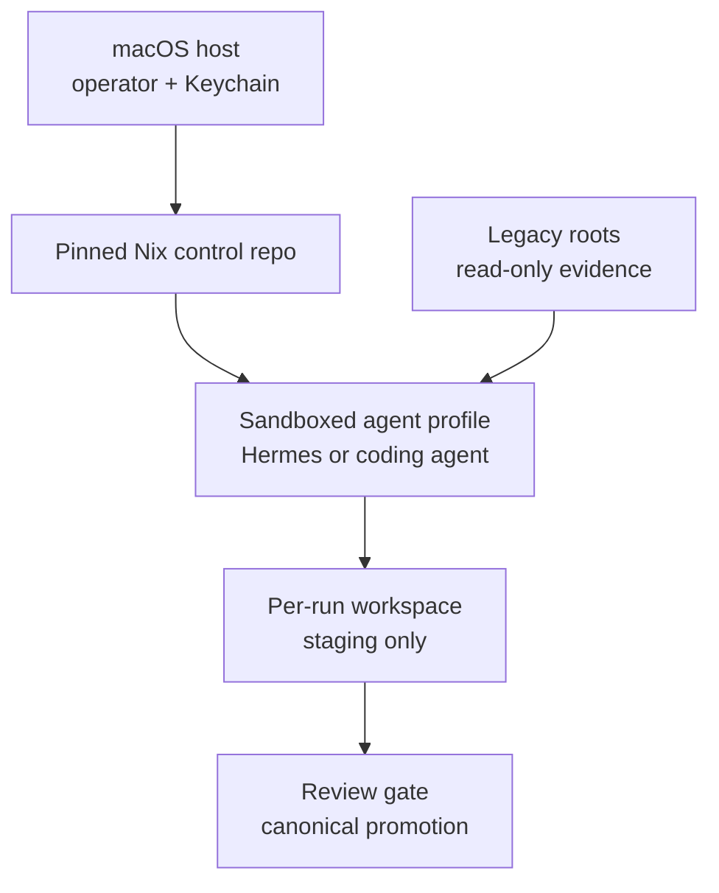
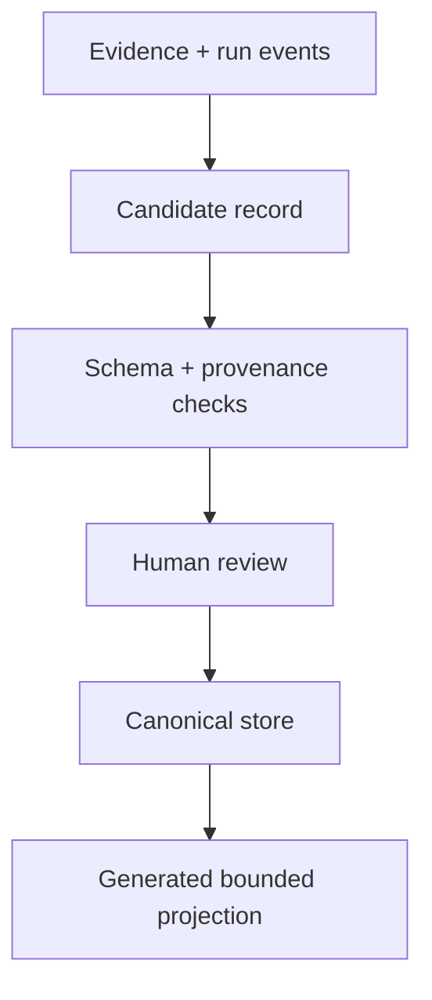

# Sovereign Node Foundation v0.1

**Decision brief for a clean, inspectable personal-agent base**  
**Date:** 2026-08-10  
**Scope:** Mac mini M4; Hermes Agent; Nix/Unix-style control plane; code archaeology; memory; agent security; experimental observer work

> **S — State line.** The clean slate should be a new authority boundary, not a mass reorganization of the existing Mac. Keep legacy roots untouched and read-only; create one small, versioned control repository beside them. Adopt ICM's best move—small routing files, explicit stage contracts, scoped context, visible intermediate artifacts—but do not mistake folders for enforcement. Files make state legible; OS policy controls authority. Use Hermes as a replaceable interaction runtime inside a constrained profile, not as the constitution, memory source of truth, or host administrator. Disable durable memory initially; later promote reviewed, source-scoped records into a typed canonical store and compile bounded `MEMORY.md`/`USER.md` projections from it. Gate all skill changes, pin dependencies, keep secrets outside model context, and deny external actions by default. The first reference organism should be a non-destructive code-archaeology pipeline over one bounded legacy family. Multi-observer, Levin, and Hoffman-inspired work belongs after that pipeline passes baseline tests, as a measured experiment over common evidence—not as proof of a multi-agent architecture.

## 1. Decision

Build **ST-001 Sovereign Node** as a thin, reproducible control plane with four separable layers:

1. **Reproducible substrate** — macOS remains the hardware/desktop host; pinned Nix configuration defines the operator toolchain; agent execution occurs in a constrained Linux container or VM.
2. **Interpretable workflow plane** — Git-tracked, ICM-inspired stage contracts and run manifests; deterministic scripts do mechanical work; models handle bounded interpretation.
3. **Replaceable agent runtime** — Hermes is the persistent interaction shell; Codex or another coding agent can build, audit, and test the same workspace through `AGENTS.md` without sharing mutable agent state.
4. **Governed state plane** — immutable evidence, append-only run receipts, proposed memory/skills, and human-approved canonical projections are separate things.

The first useful system is not an all-purpose assistant. It is a small organism that can inventory one legacy code family, preserve lineage, extract a survivor, verify it, and stop without deleting or moving the source.

## 2. Governing intention and assumptions

### Intention

The record across the recent work is consistent:

- local-first where practical;
- observable, reversible, composable, and recoverable;
- sources preserved before interpretation;
- evidence, inference, proposal, and absence kept distinct;
- no new abstraction without a discriminating test;
- human authority at promotion and external-action boundaries;
- graceful degradation and a manual exit from every important automation.

### Current assumptions

| Assumption | Status | Consequence if false |
|---|---|---|
| Mac mini M4, 32 GB RAM, 512 GB storage, 10 GbE is the primary node | Imported from prior record; verify | Model sizing, VM allocation, and storage layout change |
| A Nix/nix-darwin baseline exists or was attempted | Imported; unverified | Start with host inventory before selecting a new flake |
| Hermes is not yet safely bounded on the real machine | High-confidence inference | No host-wide or always-on deployment yet |
| Old CODE/Drive/KRAKEN/proto-kernel families contain reusable lineage | Imported; paths and hashes missing | First workflow must inventory, not reorganize |
| Custom glue should avoid adding a new Python codebase | Imported preference | Keep Python as a pinned Hermes implementation detail; use shell or TypeScript for our glue |
| External messaging, cron, and autonomous sending are not foundation requirements | Supported by prior gates | Keep them disabled until the read-only organism passes |

## 3. Project lineage: what survives

This is a lineage map, not a list of similarly named folders.

| Source / branch | What it was trying to solve | Evidence | Survivor | Disposition | Confidence |
|---|---|---|---|---|---|
| `void-anchor` | Minimal local agent substrate | Prior script inventory | Loopback-only services, explicit data/memory/session roots, Nix/Homebrew/uv/Ollama awareness | Preserve as evidence; mine only bounded fragments | Medium-high |
| “kitchen sink” branch | One-shot complete local stack | Prior script inventory | It identifies possible future services and integration pressure | Do not use as baseline; Redis, MQTT, Caddy, Docker, Tailscale return only with a tested need | High |
| `PROJECT-FEDERATION-GATE1-A003-v0.2.xlsx` | Recover a large, duplicated project estate without erasure | 117 indexed projects, 37 artifacts; inventories still missing | Stable IDs, missingness, next action, revision trigger, no deletion-based dedup | Governing archaeology ledger | High |
| `YOU_ARE_A_WAKE_OPEN_AIR_CODEX.pdf` | Constitutional discipline for reconstruction | Prior artifact review | Preserve sources; label claims; expose operator/failure; test before branching; maintain exits | Translate into short machine-checkable laws and tests | High |
| `phantom-grid-v28-model-registry.json` | Model/runtime routing | Prior artifact review | OpenAI-compatible local endpoint, small/default versus larger/escalation routing | Treat all listed models as historical until live benchmark | High |
| ST-004 Hermes workspace | Bounded persistent agent | Federation record | First test is read-only registry query with logged I/O; fail if filesystem/tool bounds are unclear | Continue, but with stronger memory/skill gates and container policy | High |
| KS-004 / KS-023 | Code archaeology and non-destructive dedup | Federation record | Read-only inventory, hashes, provenance, exact duplicates separated from meaningful variants | Make this the first reference organism | High |

### Duplicate and variant rule

Do not deduplicate by filename, folder name, or superficial similarity. First classify:

- exact duplicate: identical content hash;
- generated duplicate: same derivation with reproducible transform;
- historical variant: different implementation representing a meaningful decision;
- abandoned branch: incomplete but evidential;
- survivor fragment: smallest tested component worth carrying forward;
- unknown relation: insufficient evidence.

No source is deleted or moved in the inventory pass. A later approved migration may create references, copies, or an archive manifest while preserving the original location and hash.

## 4. ICM: adopt the method, not the mythology

The paper, [Interpretable Context Methodology: Folder Structure as Agent Architecture](https://arxiv.org/html/2603.16021v2), is directionally aligned with this project. Its public [ICM architect repository](https://github.com/RinDig/icm-architect) confirms that the implementation is chiefly a skill, Markdown contracts, and templates—not a security runtime or durable workflow engine.

### What is solid and useful

- One stage has one job.
- A small root routing file points to content but does not contain it.
- Each stage names exact inputs, process, outputs, and the human check.
- Stable reference material is separate from per-run artifacts.
- Context is selected deliberately rather than filling the model window.
- Intermediate outputs are inspectable edit surfaces.
- Deterministic scripts perform deterministic work.
- Git and plain files make change review and portability easy.
- Recurring corrections should change the source contract or reference, not only patch the final output.

These are good Unix/compiler/literate-programming moves. They are especially suitable for code archaeology because the workflow is sequential, reviewable, repeatable, and provenance-sensitive.

### What the paper has not established

The paper itself is unusually candid here:

- its 52-person community is invite-only and self-selected;
- the often-mentioned 30-of-33 intervention pattern is informal self-report;
- most use is still content production;
- testing used one model family;
- there is no controlled same-task comparison with a monolithic prompt;
- the 2,000–8,000-token stage range is representative, not a demonstrated optimum.

Therefore, treat ICM as a promising architecture pattern with high interpretability value, not as empirical proof that folders replace orchestration in general.

### Required modifications

| ICM claim or practice | Tailored modification |
|---|---|
| “The filesystem is the state machine” | The filesystem stores state; a manifest and validator define valid transitions; OS policy enforces authority |
| Folder numbering defines sequence | Numbering is a human affordance; `stage.yaml`/JSON schema and dependencies are canonical |
| Every output is directly editable | Raw model output and run receipts are immutable; human corrections are patches or reviewed derived artifacts |
| Plain text carries everything | Text carries contracts and metadata; original binaries remain content-addressed evidence |
| One fact has one home | One canonical record has one identity; projections may be generated and must name their source |
| Human review between all stages | Keep for the first organism; later gates may be relaxed only after measured false-positive/false-negative rates |
| A single agent replaces multi-agent orchestration | Use one agent by default; add independent observers only where disagreement can be measured and useful |

The central distinction is:

> **Files make state legible. Permissions make authority real.**

## 5. Current security research changes the default

This is not a general warning about “AI risk.” It is a set of concrete engineering consequences.

### 5.1 Untrusted data cannot share control authority

[CaMeL](https://arxiv.org/abs/2503.18813) separates control flow derived from the trusted user request from untrusted values returned by tools, then uses capabilities to restrict data flow. Its reported result—67% of AgentDojo tasks solved with its stated security guarantees—also exposes the utility trade-off: secure composition can reject tasks that an unconstrained agent would attempt.

[Google DeepMind's Gemini defense report](https://arxiv.org/abs/2505.14534) reinforces three relevant points: better general capability is not automatically better security; static defenses look stronger than they are under adaptive attacks; robust systems need defense in depth.

**Design consequence:** a web page, email, repository file, model output, or old note is data. It cannot modify policy, select new authority, install a skill, commit memory, or expand network access. Those transitions require a trusted control path and a separate approval or validator.

### 5.2 Persistent memory is a commit boundary

[From Untrusted Input to Trusted Memory](https://arxiv.org/html/2606.04329v1) studies four memory-write channels and evaluates OpenClaw and Hermes. Under one model and default configurations, it reports average attack success of 50.46% and retrieval success of 41.05%. The benchmark is limited—it uses one model and emulates some tool delivery—but the structural result matters: input-time prompt-injection detection does not adequately govern memory writes. Defense must operate at the write path.

The newer [persistent-sycophancy benchmark](https://arxiv.org/html/2607.10526v3) reaches a complementary result: once an error or user-aligned distortion is committed to durable state, it is more likely to influence later sessions. The dangerous transitions include promotion of tentative statements into facts, loss of attribution, and scope broadening.

**Design consequence:** memory is not a transcript summary. It is a reviewed database commit with provenance, scope, status, and lifecycle.

### 5.3 Skills are executable supply chain

The 2026 empirical study [Agent Skills in the Wild](https://arxiv.org/abs/2601.10338) reports vulnerabilities in 26.1% of 31,132 analyzed skills using its combined static/LLM classifier. The exact rate depends on that classifier and marketplace sample, but the qualitative result is sufficient: a skill may contain instructions, scripts, dependencies, secret declarations, and network behavior. It is code with unusual social packaging.

**Design consequence:** no unattended marketplace installation, no `curl | shell`, no auto-update, no agent-authored skill becoming live directly. Every live skill is pinned, hashed, reviewed, scoped, and tested. Generated skills land in proposals.

### 5.4 Model-side scanners are not hard boundaries

Hermes' own [security documentation](https://hermes-agent.nousresearch.com/docs/user-guide/security) describes multiple useful layers, but its safe-root guard applies to file tools; terminal commands still run with the authority of their process environment. Hermes recommends isolated terminal backends for stronger boundaries. [NVIDIA OpenShell](https://docs.nvidia.com/openshell/about/overview) is a useful reference design because filesystem, network, process, and inference policy are outside the model and expressed declaratively.

**Design consequence:** prompt rules and dangerous-command pattern checks are secondary. Primary controls are an unprivileged identity, mount policy, network policy, secret mediation, resource limits, immutable inputs, and an explicit export path.

## 6. Proposed architecture



### 6.1 Host

- macOS stays small: terminal, virtualization/container engine, Nix/nix-darwin, backup, and credential store.
- No agent gets host-wide home-directory access.
- Secrets remain in Keychain or a host-side broker and are injected only for a named capability.
- A Linux VM or constrained container provides the agent boundary. On macOS, a Linux VM ultimately enforces Linux isolation features more faithfully than a local Python process.
- The substrate is pinned by lockfile and rebuilt in a disposable environment before touching the working node.

### 6.2 Control repository

The exact host paths must be chosen after inventory. The repository itself should remain small:

```text
sovereign-node/
├── flake.nix
├── flake.lock
├── AGENTS.md
├── laws/
│   ├── invariants.md
│   ├── threat-model.md
│   └── claim-types.md
├── profiles/
│   ├── observe/
│   ├── research/
│   ├── build/
│   └── act-disabled/
├── schemas/
│   ├── stage.schema.json
│   ├── claim.schema.json
│   ├── memory.schema.json
│   └── run-receipt.schema.json
├── skills/
│   ├── approved/
│   ├── proposals/
│   └── skills.lock
├── workspaces/
│   └── code-lineage/
├── tests/
│   ├── fixtures/
│   └── adversarial/
└── scripts/
```

`AGENTS.md` is a routing surface, ideally under roughly 60 lines. It identifies the project, laws, task routes, and verification commands. It does not become a second brain.

### 6.3 Authority profiles

| Profile | Reads | Writes | Network | Secrets | Durable state | Intended use |
|---|---|---|---|---|---|---|
| `observe` | Explicit evidence roots, read-only | Per-run temp only | Off | None | None | Inventory, classification, offline review |
| `research` | Explicit roots + fetched public sources | Staging/export only | Domain allowlist | No general credentials | None | Source-grounded research |
| `build` | One repository/worktree | That worktree only | Off by default; package registries by gate | Task-specific token via broker if essential | Proposed diffs only | Implementation and tests |
| `act` | Minimal required resource | External side effect | Exact endpoint | Capability-specific | Signed receipt | Disabled until separate acceptance gate |

There is no universal “trusted agent” profile. Authority is granted to a task class, not to a persona or model.

## 7. Hermes: recommended role and setup policy

Hermes is currently a strong candidate for the interaction runtime because it combines sessions, local/cloud model routing, context files, FTS search, skills, profiles, gateways, voice, cron, and several terminal backends. That strength is also why it should not define the foundation.

As of this brief, the latest signed release listed by the project is [v0.20.0 / 2026.8.3](https://github.com/NousResearch/hermes-agent/releases). It is recent and has open installation/runtime reports. Do not equate “latest” with “known good.” Select a tag or commit through a disposable compatibility test, record its hash, and disable automatic updates.

### Foundation policy

1. One isolated `HERMES_HOME` per profile. Never share a home between concurrent Hermes processes.
2. Run Hermes through its Docker backend or a stronger external sandbox; never as an unrestricted local terminal agent.
3. Start with `memory_enabled: false`.
4. Before enabling memory, set the documented `memory.write_approval: true` and test its foreground, background, CLI, and gateway paths.
5. Set `skills.write_approval: true`; agent-generated changes remain staged until diff review.
6. Keep forwarded environment variables empty. A skill declaring required secrets is a request for review, not automatic authorization.
7. Disable gateways, cron, browser automation, MCP servers, and external connectors in the first profile.
8. Mount selected evidence read-only. Give the agent an ephemeral working directory and one explicit export directory.
9. Keep `SOUL.md` tiny and stylistic. No permissions, facts, paths, or architecture live there.
10. Use `AGENTS.md` for interoperable project routing. Do not maintain divergent Hermes/Claude/Codex copies.
11. Record model ID, provider, context files and hashes, skill lock, tool policy, and input manifest in every run receipt.

The exact configuration syntax must be validated against the pinned release; this document specifies policy, not a blindly copyable YAML file.

### Hermes versus Codex

These are complementary roles:

- **Hermes:** persistent conversational shell, eventual voice/gateway surface, model routing, approved personal memory projection.
- **Codex or another coding agent:** bounded build, repository surgery, test execution, audit, and review.

They may read the same committed `AGENTS.md`, contracts, schemas, and approved skills. They should not share session databases, mutable homes, pending queues, or implicit memory.

## 8. Memory: compile it; do not accumulate it

### 8.1 State tiers

| Tier | Contents | Lifetime | Authority |
|---|---|---|---|
| Ephemeral | Current prompts, tool output, scratch reasoning | One run | None |
| Working | Run artifacts, candidate claims, candidate memories | Until review/expiry | Proposed |
| Canonical | Approved facts, preferences, constraints, procedures, decisions | Versioned with review dates | Explicitly granted |
| Archive | Superseded records and immutable evidence | Retained by policy | Historical, not active |

### 8.2 Canonical memory record

Every durable record needs at least:

| Field | Purpose |
|---|---|
| `id` | Stable identity |
| `kind` | fact, preference, constraint, hypothesis, procedure, decision |
| `value` | Bounded content |
| `source_refs` | Exact artifact/message/run identifiers |
| `attribution` | Who asserted or inferred it |
| `evidence_status` | source, inference, proposal, imported, metaphor |
| `scope` | project, task, domain, audience, time |
| `authority` | advisory, routing, policy; default advisory |
| `confidence` | Epistemic confidence, separate from authority |
| `sensitivity` | Public, private, secret-reference-only |
| `created_at` / `review_at` | Lifecycle |
| `supersedes` | Revision chain |
| `commit_state` | proposed, approved, rejected, expired |

Confidence is not authority. Repetition is not independent evidence. A user preference does not become a global policy. A successful tactic does not become an executable procedure without review.

### 8.3 Compiled projections



Hermes' `MEMORY.md` and `USER.md` should be generated projections of approved records, not the canonical store. The projection is bounded, scoped to one profile, and reproducible. Recurring corrections are made in the source record and recompiled. Direct edits to generated projections fail validation.

Start with files plus SQLite FTS for retrieval. Do not add a vector database, Honcho, Mem0, Letta, or a bespoke embedding service until a fixed retrieval benchmark shows that lexical/provenance-aware search is insufficient.

## 9. First reference organism: bounded code archaeology

Select one meaningful legacy family—not the whole home directory. Good candidates from the prior record are KRAKEN 2019, the proto-kernel, or one duplicated CODE project with a known desired output.

```text
workspaces/code-lineage/
├── WORKSPACE.md
├── _shared/
│   ├── claim-types.md
│   ├── disposition-rules.md
│   └── output-schemas/
├── 00_intake/
│   └── CONTEXT.md
├── 10_inventory/
│   └── CONTEXT.md
├── 20_cluster/
│   └── CONTEXT.md
├── 30_interpret/
│   └── CONTEXT.md
├── 40_verify/
│   └── CONTEXT.md
├── 50_decide/
│   └── CONTEXT.md
└── runs/<run-id>/
    ├── inputs.lock
    ├── policy.lock
    ├── events.jsonl
    ├── stage-outputs/
    ├── review.md
    └── receipt.json
```

### Stage contracts

| Stage | Mechanism | Output | Human gate |
|---|---|---|---|
| `00_intake` | Declare exact roots, exclusions, desired organism, and threat/privacy boundary | Signed input manifest | Confirm scope; no content yet moved |
| `10_inventory` | Deterministic metadata and content hashes | File manifest and errors | Verify counts and inaccessible paths |
| `20_cluster` | Deterministic exact duplicates; heuristic candidate variants kept separate | Cluster manifest | Confirm no name-based deletion inference |
| `30_interpret` | Agent reads selected clusters and extracts claims/fragments with line/file provenance | Lineage graph and survivor candidates | Reject unsupported links |
| `40_verify` | Independent checker rebuilds or tests candidate against fixtures | Test results and counterexamples | Require a discriminating test |
| `50_decide` | Human selects preserve/defer/survivor/archive-reference dispositions | Decision record | No automated deletion or migration |

Mechanical inventory and hashes do not need an LLM. The model receives only the manifest plus selected files required for an interpretive question.

### Acceptance tests for v0.1

| ID | Test | Pass condition |
|---|---|---|
| F-01 | Cold walk | A fresh agent locates the current stage, exact inputs, output schema, and check in at most three reads |
| F-02 | Rebuild | Disposable environment reproduces toolchain from lockfiles |
| F-03 | Read boundary | Agent can read the declared fixture and is denied an undeclared path |
| F-04 | Write boundary | Agent writes only to its run directory/export; attempts elsewhere fail at OS level |
| F-05 | Network boundary | Observe profile cannot resolve/connect; research profile reaches only declared domains |
| F-06 | Secret boundary | Child environment, prompt capture, and logs contain no undeclared secret values |
| F-07 | Injection boundary | Adversarial instructions inside a fixture cannot change policy, invoke an undeclared tool, or create durable memory |
| F-08 | Provenance | Every interpretive claim cites source IDs; unsupported claims fail schema/verification |
| F-09 | Recovery | Interrupted run resumes or cleanly restarts without overwriting prior receipts |
| F-10 | Reversal | Proposed memory/skill/config change is a diff with an explicit reject path |
| F-11 | Archive safety | Inventory makes zero source modifications; before/after hashes match |
| F-12 | Utility | The pipeline recovers at least one known relation or correctly reports no survivor without inventing one |

The system stays a lab fixture until all boundary tests pass twice from a clean environment.

## 10. Multi-observer experiment: useful only if it beats one careful observer

### Scientific translation

[Bongard and Levin's polycomputing paper](https://arxiv.org/abs/2212.10675) argues that one substrate can support multiple useful computations depending on the observer and problem frame. This does not imply that a swarm of agents is intrinsically better. For this project, its productive translation is: **preserve a common event substrate and make observer projections explicit.**

[Hoffman, Prakash, and Chattopadhyay's Traces of Consciousness](https://www.preprints.org/manuscript/202410.1305) defines a trace order on Markov chains and develops a non-Boolean logic of partial observation. The 2026 “recursive trace logic” discussion appears to be frontier/talk-level work rather than an established software-engineering result. It should inspire a testable representation of partial views, not confer metaphysical authority on agents or architecture.

### Experiment O-001

Run only after the single-agent code-archaeology baseline exists.

1. Freeze one evidence pack and one event ledger.
2. Give three observers independent, non-overlapping contracts:
   - provenance/lineage;
   - capability/security;
   - minimal utility/survivor extraction.
3. Do not let them share scratchpads, memory, or each other's conclusions on the first pass.
4. Require a common output schema: claim, evidence IDs, omitted evidence, confidence, falsifier, requested next observation.
5. A separate adjudication step compares claims; it does not choose by majority vote.
6. Replay each view against the same event ledger, making its projection and omissions inspectable.

### Metrics and null hypothesis

Measure:

- valid, decision-changing findings unique to an observer;
- unsupported-claim rate;
- contradiction detection;
- evidence coverage and blind spots;
- cost and elapsed time;
- reproducibility under a second run/model;
- whether adjudication corrects or amplifies error.

The null hypothesis is that one careful observer plus a verifier performs as well at lower cost. Multi-observer work is retained only if it produces repeatable, validated marginal value. Agreement alone is not evidence; correlated models and shared prompts create correlated errors.

## 11. Alternatives and trigger conditions

| Option | Strength | Main cost/risk | Decision now | Trigger to revisit |
|---|---|---|---|---|
| ICM + shell/TypeScript scripts + Git | Small, legible, portable, easy to cold-walk | Weak branching/concurrency/durability unless added | **Adopt as workflow plane** | Keep while workflows are sequential and reviewed |
| Hermes | Rich persistent personal-agent shell and model/tool integrations | Large evolving surface; memory/skill defaults require governance | **Pilot in sandbox** | Promote after F-01–F-12 and version compatibility tests |
| Codex/Claude Code-style coding agent | Strong repository work, review, and tests | Not an always-on personal runtime | **Use as builder/auditor** | No need to replace; keep runtime-independent |
| OpenClaw | Broad channels, plugins, routing, personal-agent orientation | Another large mutable/plugin surface; duplicates Hermes role | **Keep sealed comparative fixture** | Only if a required channel/runtime capability is measurably better |
| LangGraph | Explicit graphs, checkpoints, human interrupts, durable execution | Framework and Python complexity; more state machinery | **Defer** | Real branching, parallelism, retries, or resumability cannot be expressed cleanly in stages |
| Temporal | Strong durable distributed workflow semantics | Operational weight far beyond a single-node foundation | **Reject for v0.x** | Multi-service, long-running side effects with strong replay/idempotency requirements |
| Letta | Structured/pinned memory blocks and archival retrieval | Agent-editable memory and another server/state model | **Benchmark later** | Compiled file/SQLite memory fails retrieval tests |
| NVIDIA OpenShell | External declarative isolation and egress/inference policy | New runtime complexity and Linux/VM integration | **Study as security shell** | Adopt if it runs reliably on the Mac VM and materially improves F-03–F-06 |
| Bespoke multi-agent framework | Maximum experimental freedom | Highest opportunity for invented infrastructure and unmeasured complexity | **Do not build yet** | O-001 demonstrates a repeatable requirement not met by isolated runs |

### Karpathy-inspired skills

The popular [Karpathy-inspired guidelines repository](https://github.com/multica-ai/andrej-karpathy-skills) is a community package derived from Karpathy's public observations; it is not an official Karpathy system. Its useful content is small: surface assumptions, prefer simplicity, make surgical changes, and define verifiable success criteria.

Those principles already overlap the project constitution. Incorporate a short, attributed version into `laws/invariants.md` or an approved engineering skill. Do not install an entire third-party package merely to duplicate four laws, and do not treat popularity as security review.

## 12. Rollout: smallest sequence that preserves optionality

### Phase 0 — Observe the real node

- Verify backups and available storage.
- Record actual Nix, virtualization, Hermes, container, Git, and Ollama state.
- Identify the real configuration repository, if any.
- Name two or three legacy roots without scanning the whole home.
- Make no install, migration, or cleanup changes.

### Phase 1 — Reproducible empty shell

- Create the control repo and lockfiles.
- Implement only the `observe` profile.
- Add policy tests for mounts, network, secrets, and resource limits.
- Prove clean build and rollback in a disposable VM/container.

### Phase 2 — Code-archaeology organism

- Choose one bounded fixture.
- Implement deterministic inventory and receipts.
- Run one agent only for `30_interpret`.
- Pass F-01–F-12 without touching originals.

### Phase 3 — Hermes pilot

- Pin a tested Hermes tag/commit in an isolated home.
- Disable memory, skills mutation, gateways, cron, browser, and MCP initially.
- Run the same archaeology task and compare receipts with the builder/auditor agent.

### Phase 4 — Governed memory

- Add typed candidate records and human promotion.
- Generate bounded Hermes projections.
- Test scope, supersession, expiry, poisoning fixtures, restore, and deletion.
- Enable FTS retrieval only after tests pass.

### Phase 5 — Observer experiment

- Run O-001 against the fixed code-lineage evidence pack.
- Retain only if it produces validated marginal value.

### Phase 6 — One external surface

- Choose voice or one messaging gateway, not both at once.
- Keep outgoing actions in a review queue.
- Add task-specific credentials and signed receipts.
- Cron and autonomous sending remain separate later gates.

## 13. What to provide next

More links are useful only when they change a concrete decision. The highest-value input now is not another broad reading list; it is a small, privacy-reviewed state packet.

### A. Read-only platform facts

Run these individually on the Mac and paste the outputs after checking them. They should contain no secrets:

```sh
sw_vers
uname -m
nix --version
darwin-rebuild --version
hermes --version
docker --version
colima version
ollama list
```

It is normal for missing commands to report “command not found.” Do not install anything to make the list complete.

### B. Three paths, not the whole home

Provide, in prose, the paths or aliases for:

1. the current Nix/config repository, if one exists;
2. one legacy CODE/Drive root;
3. one candidate project family for the archaeology fixture.

Do not send `.env` files, API keys, SSH material, browser profiles, private messages, or a home-wide archive. If path names themselves are sensitive, replace them with stable aliases such as `LEGACY_A` and retain the mapping locally.

### C. One discriminating outcome

For the selected legacy family, state one thing the first pipeline must settle. Examples:

- identify which branch actually ran;
- recover the smallest working architecture;
- distinguish exact duplicates from intentional variants;
- locate the source of a named feature;
- reproduce one historical output from its inputs.

### D. Optional research links

Send additional sources only with one sentence saying what decision or uncertainty each might affect. That prevents the research corpus from becoming context ballast.

## 14. Unresolved items

- Actual Mac configuration, free storage, backup/restore state, and virtualization baseline.
- Current paths and Git status of the Nix and agent configurations.
- Whether a tested Hermes release works reliably with the selected local model endpoint on Apple Silicon.
- Actual installed model inventory and benchmark fit; the prior model registry is historical.
- The exact legacy family and success criterion for the first organism.
- Whether OpenShell adds enough enforceable value on this Mac path to justify its complexity.
- Threat model for later voice, Telegram, WhatsApp, email, calendar, or other external resources.
- Retention periods and sensitivity classes for canonical memory.
- Whether O-001 produces useful observer diversity or merely correlated verbosity.

## 15. Evidence register

### Primary/current external sources

- [ICM paper v2](https://arxiv.org/html/2603.16021v2) and [ICM architect repository](https://github.com/RinDig/icm-architect)
- [Hermes repository](https://github.com/NousResearch/hermes-agent), [security](https://hermes-agent.nousresearch.com/docs/user-guide/security), [memory](https://hermes-agent.nousresearch.com/docs/user-guide/features/memory), [skills](https://hermes-agent.nousresearch.com/docs/user-guide/features/skills), [context files](https://hermes-agent.nousresearch.com/docs/user-guide/features/context-files), and [profiles](https://hermes-agent.nousresearch.com/docs/user-guide/profiles)
- [OpenAI Codex AGENTS.md](https://learn.chatgpt.com/docs/agent-configuration/agents-md), [skills](https://learn.chatgpt.com/docs/build-skills), [security/approvals](https://learn.chatgpt.com/docs/agent-approvals-security), and [subagents](https://learn.chatgpt.com/docs/agent-configuration/subagents)
- [CaMeL](https://arxiv.org/abs/2503.18813)
- [Lessons from Defending Gemini Against Indirect Prompt Injections](https://arxiv.org/abs/2505.14534)
- [From Untrusted Input to Trusted Memory](https://arxiv.org/html/2606.04329v1)
- [Persistent sycophancy benchmark](https://arxiv.org/html/2607.10526v3)
- [Agent Skills in the Wild](https://arxiv.org/abs/2601.10338)
- [AgentSys](https://arxiv.org/abs/2602.07398) for isolated worker contexts and schema-validated returns
- [NVIDIA OpenShell](https://docs.nvidia.com/openshell/about/overview)
- [LangGraph](https://docs.langchain.com/oss/python/langgraph/overview), [Letta memory blocks](https://docs.letta.com/v1-sdk/memory/memory-blocks), and [OpenClaw security](https://docs.openclaw.ai/gateway/security)
- [Polycomputing](https://arxiv.org/abs/2212.10675) and [Traces of Consciousness](https://www.preprints.org/manuscript/202410.1305)

### Project evidence used

- `PROJECT-FEDERATION-GATE1-A003-v0.2.xlsx`
- `YOU_ARE_A_WAKE_OPEN_AIR_CODEX.pdf`
- `phantom-grid-v28-model-registry.json`
- `pg27-mac-host.sh`
- `pg27-mac-kitchen-sink.sh`
- recovered thread decisions for ST-001, ST-002, ST-003, ST-004, ST-005, ST-006, ST-008, KS-004, and KS-023

### Claim labels

- **Source:** directly present in an artifact or primary source.
- **Imported:** recovered from a prior decision and still awaiting live verification.
- **Inference:** reasoned synthesis from sources; not itself measured.
- **Proposal:** architecture or test to be implemented.
- **Metaphor/lens:** conceptual aid with no enforcement or evidential authority.

## 16. Immediate levers

1. **State packet:** return the command outputs and the three bounded path aliases from §13.
2. **Fixture choice:** choose one legacy family and one question the archaeology run must settle.
3. **Then build:** use those facts to produce the read-only audit script, exact repository skeleton, pinned Hermes test matrix, and F-01–F-12 harness—before any cleanup or always-on agent deployment.
