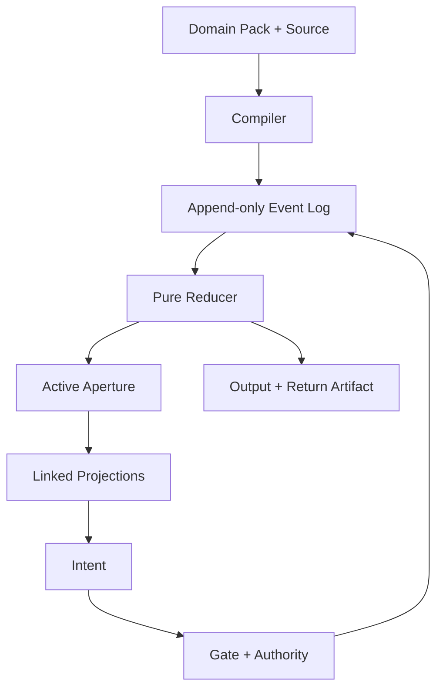

# ONE RETURN

## SEAM ENGINE — Research and Design Specification v0.2

**Date:** 2026-09-10  
**Status:** active specification; implementation incomplete  
**Scope:** ONE RETURN / ASCII City as reference organism; reusable projection, composition, evidence, and Return mechanisms beneath it  
**Supersedes:** `ONE_RETURN_SEAM_ENGINE_RESEARCH_v0.1.md`  
**Evidence classes:** `A` attested artifact · `C` current code/test · `P` primary external source · `I` inference · `U` unresolved

---

# 1. Abstract

ONE RETURN is a research/design artifact for making one bounded field of source material, state, action, and evidence legible through several coordinated forms. SEAM ENGINE is its operative substrate.

The canonical object is not a maze, disc, glyph, room, cassette, or dashboard. It is a typed, replayable event/state structure. Each surface is a projection that must declare:

- what it preserves;
- what it hides;
- what it permits;
- what is lost in translation;
- how any edit returns to canonical state.

The governing pipeline is:

```text
SOURCE
→ COMPILE
→ TYPED ENTITIES / RELATIONS / STATES / EVENTS
→ ACTIVE APERTURE
→ LINKED PROJECTION
→ USER INTENT
→ TRUTH / FIT / REVERSAL / PROOF CHECK
→ EVENT
→ OUTPUT
→ RETURN ARTIFACT
```

ONE RETURN supplies the first demanding implementation: a deterministic text-built city in which navigation, representation change, evidence, and return are enacted rather than merely described. House/room state supplies the first unrelated adapter. A successful v1 must prove that the same identity and event trace survive both domains without flattening their vocabularies.

The specification does **not** claim a universal life model, a new scientific theory, or a requirement for automated architecture. Its contribution is narrower and testable: stable semantic identity across linked projections; typed seams and ports; reversible, authority-bounded transformations; and evidence-bearing return.

> **S=StateLine:** Archive large. Canon small. Aperture smaller. A projection enters the active system only when it changes a decision, exposes a constraint, or verifies a return.

---

# 2. Research Question

## 2.1 Primary question

Can one canonical event/state substrate project coherently into:

1. an ASCII city or maze;
2. a radial DataDisc;
3. a route/graph view;
4. a glyph or verse-cell view;
5. a room/cube model;
6. a small physical or simulated control surface;

while preserving identity, direction, authority, reversibility, evidence, and replay?

## 2.2 Operational subquestions

| ID | Question | Required evidence |
|---|---|---|
| RQ-1 | Does switching projection reveal a relation or constraint that the previous view hid? | Task performance or correct prediction changes—not aesthetic preference alone |
| RQ-2 | Can an edit made through one authorized view round-trip through canonical state and appear correctly in every linked view? | Deterministic `intent → event → reduce → project` test |
| RQ-3 | Can ONE RETURN and one House Zone use the same kernel without domain vocabulary leaking into it? | Second Domain Pack added without changing core semantics |
| RQ-4 | Can a source phrase or cell change a governing rule rather than merely seed layout and decoration? | Named source feature changes one guard, cost, affordance, or consequence |
| RQ-5 | Does a spatial representation outperform a plain list for the selected task? | Controlled comparison on prediction, recovery, retrieval, or route understanding |
| RQ-6 | Can a screen state correspond to a safe manual object/room state without ambiguity? | Shared IDs, visible disconnection, manual reset, and physical evidence receipt |

## 2.3 Falsifying condition

If a plain list preserves nearly all useful value, navigation dominates reasoning, or projections cannot round-trip without special cases, SEAM ENGINE remains a game-specific architecture and must not be promoted as a general system.

---

# 3. Definitions & Vocabulary

## 3.1 Canonical terms

| Term | Definition | Exclusion |
|---|---|---|
| **Source** | Immutable or versioned input with provenance | Not automatically truth |
| **Entity** | Stable-address object that can appear in several projections | Not its screen coordinate or visual glyph |
| **Relation** | Typed, directed or undirected connection between entities | Not generic “connectedness” |
| **State** | Current reduction of accepted events | Not the complete history |
| **Event** | Append-only record of an observed or authorized transition | Not a mutable UI flag |
| **Rule** | Trigger, guards, effects, authority, reversibility, and evidence requirements | Not lore or visual convention |
| **Port** | Typed boundary through which a declared capability or flow may connect | Not an arbitrary face label |
| **Seam** | Visible boundary, mismatch, gap, uncertainty, or translation loss | Not a defect to hide by default |
| **Projection** | A question-specific encoding of canonical state | Not a second database |
| **Aperture** | The bounded active subset rendered for a present task | Not the archive |
| **Domain Pack** | Local vocabulary, compiler, rules, projections, authority, evidence policy, and fallback | Not a reskin |
| **Cassette** | Bounded, named, reloadable arrangement that carries continuity between hosts | Not the universal ontology |
| **Route Tile** | Surface exposing typed adjacency, direction, capacity, and unresolved junctions | Not necessarily a physical tile |
| **Return Artifact** | Durable receipt containing source identity, events, delta, evidence, residue, and next route | Not a completion badge |
| **Residue** | Unresolved, rejected, stale, or untranslatable material remaining after a run | Not silent loss |

## 3.2 Distinctions that must survive

```text
observation ≠ interpretation
proposal ≠ committed state
projection ≠ source
preview ≠ canonical state
identity ≠ coordinate
orientation ≠ semantics
unknown ≠ empty
rejected ≠ deleted
replay ≠ imitation
return ≠ reset
```

## 3.3 Sleeper and portable operator names

| ONE RETURN instrument | Portable operator | Function |
|---|---|---|
| **Conch** | `OBSERVE` | Reveal source, signal, provenance, or measurable condition |
| **Keris** | `BOUND` | Add, remove, or alter a typed relation under declared cost |
| **W8** | `ANCHOR` | Preserve an address or state for later retrieval |
| **Spiral** | `REFRAME` | Change coordinates/projection while preserving identity |
| **Origin Return** | `RETURN` | Verify delta, evidence, residue, and continuation |

The poetic names remain canonical inside ONE RETURN. Portable labels make the mechanism usable without requiring adoption of Sleeper’s symbolic vocabulary.

---

# 4. Core Invariants

## I-01 — Stable identity

An entity keeps one stable ID across City, Disc, route, glyph, room, ledger, and Return views. Sorting, rotating, filtering, or moving a representation must not silently create a new entity.

## I-02 — Event authority

Views do not mutate canonical state directly. A view emits an intent; a rule checks guards, authority, reversibility, and evidence; an accepted intent emits an event; state is reduced from events.

## I-03 — Projection honesty

Every projection declares `reads`, `permits`, and `hides`. A visual correspondence is not promoted unless identity, direction, transformation, or cost survives it.

## I-04 — Round-trip discipline

Every editable projection must satisfy:

```text
GET–PUT: writing an unchanged view changes nothing.
PUT–GET: a valid view edit is visible after canonical reduction and re-projection.
REJECT: an invalid edit changes nothing and names the failed guard.
```

This applies the view-update problem as an engineering constraint rather than a metaphor.[^1]

## I-05 — Typed composition

“Connects to” must declare what crosses the seam: data, evidence, instruction, attention, material, power state, airflow indication, spatial access, or another domain-local capability.

## I-06 — Orientation is not meaning

Room/cube projections use intrinsic signed-axis faces:

```text
-X  +X  -Y  +Y  -Z  +Z
```

Default local convention:

```text
-X = input
+X = output
```

`Y` and `Z` remain typed opposite port-pairs without permanent universal semantics. Orientation `R` is separate:

```text
worldFace = R(localFace)
```

Turning a room changes `R`; it does not rewrite the program.

## I-07 — Deterministic docking

A square-face connection requires face identities plus rotation about the face normal:

```text
dock(sourceFace, targetFace, quarterTurn)
```

Ports connect only when their types/capabilities are compatible. The quarter-turn determines edge alignment. Physical, screen, and collaborative composition share this small rule; their payload and safety assumptions remain separate.

## I-08 — Reversible before irreversible

Preview, undo, branch, manual fallback, and exact restoration precede external or physical commitment. Irreversible actions require a distinct confirmation boundary.

## I-09 — Evidence before status

`discussed`, `specified`, `implemented`, `tested`, and `retained` are different states. No promotion occurs without a receipt appropriate to the claim.

## I-10 — Return with retained difference

A valid run returns source identity plus the causal delta. A loop that cannot state what changed, what persisted, and what remains unresolved is not a Return.

## I-11 — Local vocabulary, shared contract

The kernel contains no Sleeper, room, project, care, or maker vocabulary. Those meanings live in Domain Packs. Generality is demonstrated through adapters, not asserted through abstract naming.

## I-12 — Graceful degradation

Important state remains inspectable and manipulable without AI, network access, sensors, or specialized physical hardware. A plain file, printed card, or manual control remains a valid lower-fidelity host.

> **S=StateLine:** The invariant is not visual sameness. It is recoverable identity and lawful change under a different coordinate system.

---

# 5. Architecture

## 5.1 Two nested cycles

The outer work cycle is:

```text
INPUT → XFORM → FOCUS → OUTPUT → RETURN
```

The inner validity cycle is:

```text
TRUTH → FIT → REVERSAL → PROOF → RETURN
```

The outer cycle explains movement through work. The inner cycle determines whether that movement may enter canon.

## 5.2 Runtime topology



## 5.3 Minimal records

```ts
type Authority = "observe" | "propose" | "confirm" | "execute";
type Reversibility = "easy" | "costly" | "irreversible";
type EvidenceStatus = "unknown" | "attested" | "inferred" | "tested" | "rejected";

type Event = {
  id: string;
  at: string;
  actor: string;
  kind: string;
  target: string;
  payload: unknown;
  source?: string;
  evidenceStatus: EvidenceStatus;
};

type Rule = {
  id: string;
  trigger: string;
  guards: readonly string[];
  effects: readonly string[];
  authority: Authority;
  reversibility: Reversibility;
  evidenceRequired: readonly string[];
};

type Projection = {
  id: string;
  reads: readonly string[];
  permits: "read" | "propose" | "command";
  hides: readonly string[];
  intentMap?: Record<string, string>;
};

type DomainPack = {
  id: string;
  vocabulary: DomainVocabulary;
  compileSource(input: unknown): readonly Event[];
  rules: readonly Rule[];
  projections: readonly Projection[];
  evidencePolicy: EvidencePolicy;
  authorityPolicy: AuthorityPolicy;
  manualFallback: string;
};
```

These are semantic contracts, not a decision to add a statechart framework. Harel’s Statecharts and W3C SCXML justify hierarchy, parallel state, and event-driven transition semantics; the current TypeScript code can implement the required subset directly.[^2][^3]

## 5.4 Active aperture

The full archive is never the working surface.

```text
ARCHIVE: all recoverable material and lineage
CANON: retained identities, rules, fixtures, and decisions
APERTURE: the smallest set required for the current action
```

The v1 aperture contains only:

- `FOCUS` — selected entity, source, state, and permitted actions;
- `DISC` — cyclic/phase neighborhood;
- `ROUTES` — adjacency, direction, blockage, and seam state;
- `LEDGER` — event/evidence history;
- `RETURN` — delta, residue, and next route.

`TECH TREE`, 3D room traversal, global search, and agent orchestration remain outside the first aperture.

## 5.5 Current implementation boundary

Current ONE RETURN already supplies deterministic phrase/cell/figure compilation, enacted Gates, City/Disc display, witness import/export, and Return Artifact generation. Its automated baseline on 2026-09-10 passed 12 engine tests, 360 generated-world geometry audits, the production build, and three rendered-route tests.

This proves deterministic generation and route viability. It does **not** prove full event replay, bidirectional projection editing, cross-view understanding, source-semantic consequence, House Zone reuse, or physical correspondence.

---

# 6. Mechanisms

## M-01 — Compile source into law

Source may determine topology, tokens, ordering, thresholds, or available operations only through named compiler rules. Every source-derived rule records provenance. A phrase must eventually affect a decision-relevant consequence; visual hashing alone is insufficient.

## M-02 — Reduce events, never reconcile views ad hoc

All accepted changes append events. The reducer computes canonical state. Views never synchronize directly with one another; they re-project from the same reduced state.

## M-03 — Coordinate projections

Selecting one entity in any view highlights its counterparts elsewhere. Each view answers a specific question:

| View | Primary question | Natural structure |
|---|---|---|
| `FOCUS` | What is active now? | bounded card / local neighborhood |
| `DISC` | What is cyclic, phased, or radially related? | angle + radius + channels |
| `ROUTES` | What connects, blocks, branches, or returns? | graph / maze / room path |
| `LEDGER` | What occurred, why, and with what evidence? | ordered event trace |
| `RETURN` | What changed and what survives? | receipt / witness |

Different representations may contain related information while making different inferences easier; coordinated views are justified only when the coordination improves a task.[^4][^5]

## M-04 — Expose seam state

Every boundary is one of:

```text
OPEN · CLOSED · PROPOSED · BLOCKED · UNKNOWN · STALE · DISCONNECTED
```

Seam state is encoded redundantly through text/symbol plus visual treatment. A missing sensor, stale file, rejected translation, or disconnected physical object cannot appear as current truth. Seamful design supports exposing infrastructural limits when they become useful interactional information.[^6]

## M-05 — Compose rooms through ports

ROOM is a typed projection, not a generic cube metaphor.

- six intrinsic signed-axis ports;
- three opposite pairs;
- orientation stored separately;
- compatible capabilities required;
- quarter-turn stored at docking;
- edge and vertex semantics introduced only when a fixture requires them.

This law spans screen rooms, route tiles, cassettes, and low-load physical mockups without claiming identical implementation.

## M-06 — Enact four operator families

```text
OBSERVE   = provenance + truth + measure
TRANSFORM = compression + bounded operation
PERSIST   = anchor + retrieval + resilience
TRANSLATE = reframe + transfer + return
```

ONE RETURN’s Eight Gates remain game-specific tests beneath these four portable families. The families are not new Gates; they are the smallest vocabulary that survives translation.

## M-07 — Preview and branch

A proposed transformation creates a scenario branch. Canonical state changes only after confirmation. Rewind restores the exact prior event boundary. Preview, current, and historical states remain visually distinct.

## M-08 — Correspond physically without hidden authority

Physical development follows:

```text
move information
→ move light
→ move low-load manual objects
→ move manual partitions
→ powered architecture only after professional safety design
```

The first physical witness is paper/cardboard or an on-screen small-box simulator. It carries stable IDs, seam state, and confirmation—not autonomous control. Tangible Bits, SandScape, CityScope, and Dynamicland demonstrate useful coupling between digital state, physical manipulation, and visible attribution; they do not make moving architecture a necessary first step.[^7][^8][^9]

## M-09 — Emit an evidence-bearing Return

Minimum Return Artifact:

```json
{
  "worldKey": "stable-id",
  "domainPack": "pack-id",
  "sourceRefs": [],
  "eventIds": [],
  "before": {},
  "after": {},
  "delta": [],
  "evidence": [],
  "residue": [],
  "nextRoutes": []
}
```

The artifact must reload the same canonical state or fail explicitly. It does not claim completion when residue remains.

---

# 7. Acceptance Gates

## 7.1 Canon gates

| Gate | Question | Minimum evidence | Failure action |
|---|---|---|---|
| **G0 TRUTH** | What exists, and how do we know? | Source/provenance; current material or code state; unknowns marked | Return to source capture; do not infer completion |
| **G1 FIT** | What enters, exits, connects, and remains blocked? | Typed input/output/ports; relation direction; named incompatibility | Revise adapter or keep domains separate |
| **G2 REVERSAL** | Can the change be previewed, undone, ejected, or performed manually? | Exact undo/reload; authority boundary; fallback | Reduce scope or reject irreversible step |
| **G3 PROOF** | Did the mechanism produce the claimed effect? | Fixture, deterministic verifier, observation, or comparison | Retain as proposal only |
| **G4 RETURN** | What durable delta, residue, and continuation remain? | Reloadable witness/receipt plus unresolved state | Run is incomplete; no promotion |

## 7.2 Required v1 fixtures

1. **Legacy DataDisc fixture:** rebuild one existing DataDisc projection without mutating its source.
2. **Linked identity fixture:** one entity remains selected across `FOCUS`, `DISC`, `ROUTES`, and `LEDGER`.
3. **Projection round trip:** one reversible edge edit passes `GET–PUT`, `PUT–GET`, and atomic rejection.
4. **ROOM fixture:** six signed-axis ports, orientation `R`, and one deterministic quarter-turn dock.
5. **Route fixture:** one real room route declares edge types, inspection points, and unresolved junctions.
6. **Physical fixture:** one low-load cardboard Route Tile or SINDER Joint demonstrates connection and reversal only; no structural, human-support, mains, or plumbing claim.
7. **Domain fixture:** ONE RETURN and House Zone load through the same core without category collapse.
8. **Return fixture:** exported artifact reloads identical state and records delta, residue, and next route.

## 7.3 Human tests

Automation proves consistency; people test legibility and consequence. Compare the linked specimen with a plain list and a single-view condition. Measure separately:

- time to first valid action;
- correct prediction of one rule consequence;
- recovery after a deliberate error;
- ability to identify what changed and why;
- delayed retrieval of one anchor;
- transfer to an unfamiliar projection;
- setup/reset time for the physical fixture;
- self-reported clarity and overload;
- voluntary second use.

Five to eight formative testers can expose design failures; they cannot establish broad efficacy.

## 7.4 Promotion rule

```text
PASS G0–G4
→ retain one version
→ record evidence
→ revise once if one named gate fails
→ otherwise archive
→ stop
```

No feature enters canon because it is beautiful, plausible, discussed repeatedly, or expensive to discard.

---

# 8. Rejected / Non-Goals

| Rejected direction | Reason |
|---|---|
| Everything becomes a maze | Chronology, uncertainty, comparison, and evidence often require other views |
| Maze, disc, glyph, room, cassette, tile, route, and hinge become synonyms | Their transforms and interaction costs differ |
| Cassette becomes the universal ontology | Cassette carries continuity; it does not explain every relation |
| One universal Domain Pack | Generality lives in the contract; meaning remains local |
| Entire archive rendered as interface | Produces a museum, not an active field |
| More districts, Gates, lore, or mini-games before kernel proof | Expands content while leaving causality unverified |
| 3D room, database, agents, or cloud services in v1 | None is required to test the central claim |
| Automatic messages, purchases, deletion, or external actions | Violates explicit authority and consent boundaries |
| Hidden sensing or inferred inner truth | Observation and interpretation must remain distinct |
| Powered partitions as prototype | Adds safety and mechanical problems before correspondence is proven |
| Global diagonals, seams, or crossings | Cell Path tests show permissive edges can inflate noise and erase authored cost |
| Poetic naming as evidence | Symbolic density may guide experience; it does not validate a mechanism |
| “Transformative” as a release criterion | Transformation must be decomposed into measurable prediction, retrieval, action, or retained delta |

The project may remain beautiful, strange, and personally specific. Those qualities stay in the ONE RETURN projection; they do not replace core tests.

---

# 9. Unresolved Constraints

| ID | Unresolved item | Consequence | Next evidence |
|---|---|---|---|
| U-01 | Exact phrase/cell semantics that should alter governing law | Current source relation may remain decorative | Define one bounded classifier and one changed guard |
| U-02 | Exact authorial relation between nine V4 cells and Nine Gates | Structural resemblance may be mistaken for provenance | Targeted source note/coordinate recovery only |
| U-03 | Verbatim wording of the second recently pinned WORLD/Interphase mandatory item | Risk of silently reconstructing a decision | Keep absent until recovered; typed ROOM remains the only verbatim recovered mandate |
| U-04 | Actual Bendemeer room measurements, anchors, egress, loads, and attachment constraints | Blight board cannot function as build specification | Real survey and annotated photo/plan |
| U-05 | Domain-local meanings for `±Y` and `±Z` ports | Premature semantics would hard-code one application | Leave typed but unnamed until two fixtures force roles |
| U-06 | Whether City↔Disc improves reasoning rather than atmosphere | Linked views may be ornamental | Controlled single-view comparison |
| U-07 | Exact second Domain Pack boundary | “House OS” is still too broad | Use one House Zone and one route/reset action |
| U-08 | Best physical witness | Box, tile, light, or room marker may have different costs | Simulate first; compare reset and comprehension |
| U-09 | Full action trace and branch representation in current code | Witness is not yet complete replay | Pure reducer and replay fixture |
| U-10 | Generalization beyond the user’s own systems | Shared vocabulary may fail for others | Test ordinary labels with unfamiliar users |

Unresolved means unavailable or unproven. It does not invite automatic completion by analogy.

---

# 10. Smallest Next Implementation

## 10.1 Name

**ONE RETURN // INTERPHASE TILE v0.1**

This is a demonstrator inside the SEAM ENGINE specification, not a new product family.

## 10.2 Inputs

1. One immutable legacy DataDisc fixture.
2. One current Bendemeer room-zone image or measured sketch.
3. One manually authored House Zone record: anchors, route, present state, proposed state, reset state, and unknowns.

## 10.3 Kernel

- explicit stable IDs;
- append-only events;
- pure reducer;
- typed relations and seam states;
- authority and reversibility on every command;
- signed-axis ROOM ports and orientation;
- deterministic import/export witness.

No new runtime dependency is required unless a named fixture cannot be implemented with the current stack.

## 10.4 Views

| View | Required content | Interaction |
|---|---|---|
| `FOCUS` | selected source/entity, present state, provenance, legal actions | inspect / propose |
| `DISC` | stable radial address and neighborhood | select / rotate view only |
| `ROUTES` | typed room/path graph, blocked and unknown seams | select / preview one edge change |
| `LEDGER` | ordered events, authority, evidence | scrub / branch / restore |
| `RETURN` | before, after, delta, residue, next route | export / reload |

Each view displays `THIS VIEW HIDES:` followed by its declared loss.

## 10.5 One allowed transformation

Choose one room-route boundary and enact:

```text
CURRENT CLOSED
→ PROPOSE OPEN
→ CHECK FIT
→ PREVIEW ROUTES
→ CONFIRM
→ RECORD EVIDENCE
→ RESTORE OR RETAIN
→ RETURN
```

The transformation remains representational/manual. It does not actuate furniture, partitions, electrical systems, or plumbing.

## 10.6 One physical correspondence

Print or make one low-load paper/cardboard Route Tile showing:

- stable ID;
- signed-axis orientation;
- port types;
- seam state;
- quarter-turn docking mark;
- manual reset state.

The screen must detect or record the correspondence manually before sensors are considered. The physical object is evidence of comprehension and reset—not a structural component.

## 10.7 Completion condition

The demonstrator is complete only when:

1. all eight v1 fixtures pass;
2. the legacy DataDisc source remains unchanged;
3. one edge edit round-trips across all views;
4. exact replay restores both canonical state and selection;
5. House Zone requires no core rewrite;
6. the printed/manual route remains usable without the app;
7. the Return Artifact records delta and residue;
8. a plain-list comparison shows where the spatial system helps—or demonstrates that it does not.

If it passes, the next branch is one real `photo → Layer-It → alternate transformation → reversible test → printable template → physical evidence → Return` cycle. If it fails, repair the failed gate once; then demote or archive the mechanism.

> **S=StateLine:** v1 is not a world simulator. It is one proof that a source, a city/disc identity, a room route, a reversible seam, and a Return receipt can remain the same object without becoming the same view.

---

# 11. Appendix: Traceability Map

## 11.1 Lineage and disposition

| v0.2 element | Source lineage | Evidence | Disposition |
|---|---|---:|---|
| Typed event/state substrate | ONE RETURN v0.1; current City engine; Statecharts/SCXML | A/C/P | **Core** |
| Stable identity across projections | POLY/FURNISHER; DataDisc; lens research | A/P | **Core** |
| `INPUT → XFORM → FOCUS → OUTPUT → RETURN` | latest WORLD/capability-field synthesis | A | **Core work cycle** |
| `TRUTH → FIT → REVERSAL → PROOF → RETURN` | latest WORLD/Interphase acceptance law | A | **Canon gate** |
| `OBSERVE / TRANSFORM / PERSIST / TRANSLATE` | ONE RETURN Eight-Gate compression | A/I | **Portable operator family** |
| Signed-axis ROOM and `R` | POLY/FURNISHER survey/spec | A | **Mandatory projection law** |
| Quarter-turn docking | POLY/FURNISHER survey/spec | A | **Mandatory composition law** |
| City as route projection | ONE RETURN; Cell Path | A/C | **Reference view** |
| DataDisc as projection, not database | legacy DataDisc; survivor catalog | A | **Golden fixture** |
| Typed seams/edge contract | Cell Path Atlas; seamful-design research | A/P | **Core** |
| Cassette load/eject/replay | Cassette Atlas v0.1 | A | **Middle-layer pattern** |
| Blight modes and tape language | Modular Interior Systems Concept Board | A | **Physical projection fixture** |
| House Zone manual fallback | App Atlas; Cassette Atlas | A | **First unrelated Domain Pack** |
| Route Tile and low-load SINDER fixture | Project Federation Gate 1 | A | **Physical test only** |
| Linked multiple views | Larkin/Simon; Roberts; CityScope | P | **Research support** |
| Return Artifact | ONE RETURN v2; project federation evidence receipts | A/C | **Core output** |
| Autonomous room motion | adaptive-partition precedents only | P/U | **Rejected for v1** |
| General personal FSM | v0.1 inference | I/U | **Demoted; not v1** |
| Second pinned Interphase mandate | incomplete accessible wording | U | **Do not reconstruct** |

## 11.2 Version delta

| v0.1 material | v0.2 action |
|---|---|
| Broad research survey | Compressed into mechanisms and traceability |
| Eight-overlay catalogue | Reduced to five task views |
| Ten-domain possibility map | Reduced to ONE RETURN + one House Zone |
| SEAM LANTERN hardware concept | Deferred behind on-screen/paper correspondence |
| Personal decision FSM | Demoted from active build; retained only as future adapter question |
| Seven-phase research program | Replaced by one bounded demonstrator and promotion rule |
| General novelty statement | Replaced by falsifying conditions and cross-domain proof |
| Physical-room ambition | Bound to real survey, manual state, low-load fixture, and explicit safety stop |

## 11.3 Source ledger

### Private/project evidence

- `ONE_RETURN_SEAM_ENGINE_RESEARCH_v0.1.md`
- `CASSETTE_ATLAS_v0.1.md`
- `PROJECT-FEDERATION-GATE1-A003-v0.2.xlsx`
- `anthropy_working_package.md`
- `cell_path_atlas.md`
- `poly-furnisher-v0-survey-spec-1.md`
- `Modular Interior Systems Concept Board.png`
- current ONE RETURN source, tests, and `docs/ONE_RETURN_V2.md`
- latest WORLD / capability-field / Interphase decisions retrieved 2026-09-10

### Primary external anchors

[^1]: J. Nathan Foster et al., “Combinators for Bidirectional Tree Transformations,” *ACM TOPLAS*, 2007. [Author-hosted paper](https://www.cis.upenn.edu/~bcpierce/papers/lenses-toplas-final.pdf).
[^2]: David Harel, “Statecharts: A Visual Formalism for Complex Systems,” *Science of Computer Programming* 8, 1987. [Author-hosted paper](https://www.weizmann.ac.il/math/harel/sites/math.harel/files/users/user50/Statecharts.pdf).
[^3]: W3C, “State Chart XML (SCXML): State Machine Notation for Control Abstraction,” Recommendation, 2015. [Specification](https://www.w3.org/TR/scxml/).
[^4]: Jill H. Larkin and Herbert A. Simon, “Why a Diagram Is (Sometimes) Worth Ten Thousand Words,” *Cognitive Science* 11(1), 1987. [CMU record](https://digitalcollections.library.cmu.edu/node/35554).
[^5]: Jonathan C. Roberts, “State of the Art: Coordinated & Multiple Views in Exploratory Visualization,” 2007. [Author-hosted paper](https://www.cs.kent.ac.uk/pubs/2007/2559/content.pdf).
[^6]: Matthew Chalmers and Ian MacColl, “Seamful Design and Ubicomp Infrastructure,” 2003. [Author-hosted paper](https://www.dcs.gla.ac.uk/~matthew/papers/ubicomp2003HCISystems.pdf).
[^7]: Hiroshi Ishii and Tangible Media Group, “Tangible Bits.” [MIT project and papers](https://tangible.media.mit.edu/project/tangible-bits/).
[^8]: MIT City Science, “CityScopeJS” and “CityIO — UI.” [Project documentation](https://cityscope.media.mit.edu/cityscopejs/Introduction/).
[^9]: Dynamicland, “State.” [Project archive](https://dynamicland.org/archive/State).

## 11.4 Release sentence

**ONE RETURN // SEAM ENGINE v0.2 specifies one replayable event spine, five linked task views, typed signed-axis composition, five canon gates, and one two-domain demonstrator; everything else remains archive, adapter, or unresolved.**
